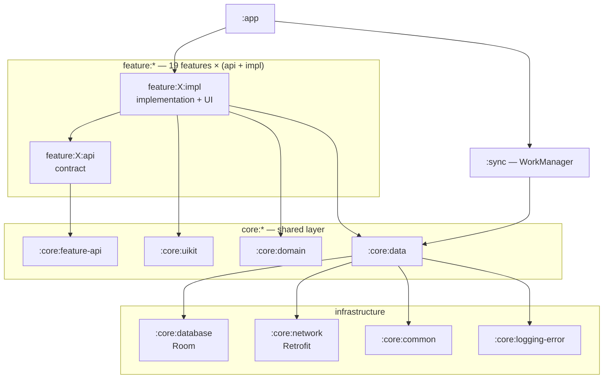

  <a href="https://github.com/IliaVoskoboinikov">🇷🇺 Русский</a> · <b>🇬🇧 English</b>

<h1 align="center">Ilia Voskoboinikov</h1>

<b>Android Engineer</b> · Kotlin · Jetpack Compose · Kotlin Multiplatform · 4+ years of commercial experience

  
  
  

  
  
  
  <!--installs-total--><!--/installs-total-->

# 👋 About me

Android developer with 4+ years of commercial experience. I've built mobile apps from scratch: from
requirements analysis and architecture design to store release and further development.
I've modernized existing codebases by introducing modern Android practices and improving engineering
quality. I've conducted technical interviews, mentored developers, spoken at conferences,
and written technical articles.

- 🧩 **Focus:** Kotlin, Jetpack Compose, Clean Architecture, multi-module projects
- 🌍 **Kotlin Multiplatform:** «Coin: Yes/No» ships to Android and iOS from a single codebase
- 💰 **Beyond code:** store releases, analytics and Crashlytics, ads and in-app purchases
- 🛠️ **Keeping projects healthy:** convention plugins, custom Lint rules, CI/CD, tests, documentation
- 📄 **CV:** [PDF (in Russian)](https://github.com/IliaVoskoboinikov/cv/blob/main/ilia_voskoboinikov_android_cv_ru.pdf) · [repository](https://github.com/IliaVoskoboinikov/cv)

# 📲 Published apps

| App | Installs | Stack |
|---|---|---|
| **[Coin: Yes/No](https://play.google.com/store/apps/details?id=v500a5v.ilua.admin.monetka&hl=en)** · [App Store](https://apps.apple.com/us/app/coin-yes-no/id6756816990) Coin-flip simulator for quick decisions. Android and iOS from a single codebase; the iOS version is published under a partner's account. | **<!--installs:v500a5v.ilua.admin.monetka-->100K+<!--/installs-->** | Kotlin Multiplatform · Compose Multiplatform · Koin · Firebase |
| **[Mafia: Card Game](https://play.google.com/store/apps/details?id=soft.divan.mafia&hl=en)** Offline host for the Mafia party game: up to 30 players, automatic role assignment. | **<!--installs:soft.divan.mafia-->5K+<!--/installs-->** | Kotlin · Compose (Material 3) · Hilt · DataStore · Play Billing · Yandex Ads |
| **[Password Generator](https://play.google.com/store/apps/details?id=soft.divan.admin.password&hl=en)** Strong passwords with configurable length and character sets. | **<!--installs:soft.divan.admin.password-->1K+<!--/installs-->** | Kotlin Multiplatform · Compose Multiplatform · Coroutines · Firebase |
| **[Rubik's Timer](https://play.google.com/store/apps/details?id=soft.divan.rubik_sclock&hl=en)** Speedcubing timer: millisecond precision, scrambles, solve statistics. | **<!--installs:soft.divan.rubik_sclock-->1K+<!--/installs-->** | Kotlin 2.3 · Compose (Material 3) · Hilt + KSP · Room · DataStore |
| **[World Words](https://play.google.com/store/apps/details?id=soft.divan.world.words&hl=en)** Vocabulary flashcards with categories and account sync. | **<!--installs:soft.divan.world.words-->500+<!--/installs-->** | Kotlin · XML + Navigation · Koin · Room · Paging 3 · Firebase (Auth, Firestore, App Check) |

Installs — Google Play data, updated automatically every week.

# 🏦 Finance Manager

  
  
  
  
  
  
  

[**A personal finance tracker**](https://github.com/IliaVoskoboinikov/Finance-Manager) —
a pet project where I try out approaches that don't always fit into day-to-day work.
19 features, each split into `api` (contract) and `impl` (implementation), so features know nothing
about each other. [The graph of all 49 modules](https://github.com/IliaVoskoboinikov/Finance-Manager/blob/master/docs/graphs/modules_prodget/all_modules.png)
is generated automatically.

| | |
|---|---|
| **Build** | 49 Gradle modules, version catalog, **convention plugins** in `build-logic` — with functional tests for the plugins themselves |
| **Quality** | Detekt + Compose rules, ktlint, a `:lint` module with **custom Lint checks**, Kover for coverage, Spotify Ruler for APK size control |
| **Tests** | **185 unit tests**: JUnit, MockK, Robolectric, AssertJ, coroutines-test, work-testing |
| **UI** | Compose + Material 3, **Navigation 3**, Lottie animations, YCharts for charts, theme and color scheme picker |
| **Data** | Room + DataStore, Retrofit with custom interceptors (Auth, Retry, NetworkConnection, Logging), kotlinx.serialization |
| **Security** | PIN and biometrics (`androidx.biometric`), `security-crypto`, OAuth via Yandex Auth SDK, JWT |
| **Background** | Sync via WorkManager (`:sync`), push notifications via FCM, Crashlytics |
| **CI/CD** | 4 workflows: build and tests on PRs, release pipeline, automatic navigation graph generation |

  
  
  
  
  

**Documentation** (in Russian): each of the 49 modules has its own `README.md`, plus 12 cross-cutting docs —
[architecture](https://github.com/IliaVoskoboinikov/Finance-Manager/blob/master/docs/architecture.md) ·
[modularization](https://github.com/IliaVoskoboinikov/Finance-Manager/blob/master/docs/modularization.md) ·
[Navigation 3](https://github.com/IliaVoskoboinikov/Finance-Manager/blob/master/docs/navigation3.md) ·
[testing](https://github.com/IliaVoskoboinikov/Finance-Manager/blob/master/docs/testing.md) ·
[CI/CD](https://github.com/IliaVoskoboinikov/Finance-Manager/blob/master/docs/ci-cd.md) ·
[synchronization](https://github.com/IliaVoskoboinikov/Finance-Manager/blob/master/docs/synchronization.md) ·
[notifications](https://github.com/IliaVoskoboinikov/Finance-Manager/blob/master/docs/notifications.md) ·
[database](https://github.com/IliaVoskoboinikov/Finance-Manager/blob/master/docs/bd.md) ·
[authorization](https://github.com/IliaVoskoboinikov/Finance-Manager/blob/master/docs/auth.md)

Also: **[design-patterns](https://github.com/IliaVoskoboinikov/design-patterns)** —
design patterns in Kotlin with examples of their use in Android.

# 🛠 Tech stack

  

|  |  |
|---|---|
| **Languages & platforms** | Kotlin, Java, Android, Kotlin Multiplatform (Android + iOS) |
| **UI** | Jetpack Compose, Compose Multiplatform, Material 3, Navigation 3, XML, Custom Views, Lottie, YCharts, Glide |
| **Architecture** | Clean Architecture, MVVM, SOLID, multi-module with `api` / `impl` split |
| **DI** | Hilt, Dagger 2, Koin |
| **Async & background** | Coroutines, Flow, WorkManager, FCM |
| **Data** | Room, SQLite, DataStore, Paging 3, kotlinx.serialization, multiplatform-settings |
| **Networking & backend** | Retrofit, OkHttp, Ktor, WebSockets, Firebase (Auth, Firestore, Storage, App Check) |
| **Security** | Biometric, security-crypto, OAuth (Yandex Auth SDK), JWT |
| **Testing** | JUnit, MockK, Mockito, Robolectric, AssertJ, Espresso, Kover |
| **Code quality** | Detekt (+ Compose rules), ktlint, Android Lint with custom checks, Spotify Ruler |
| **Build & CI/CD** | Gradle KTS, version catalog, convention plugins, KSP, GitHub Actions |
| **Product** | Google Play Billing, Play In-App Review, Yandex MobileAds, Crashlytics, Analytics |

# 📊 GitHub

  <picture>
    <source media="(prefers-color-scheme: dark)" srcset="https://raw.githubusercontent.com/IliaVoskoboinikov/IliaVoskoboinikov/main/profile-summary-card-output/github_dark/0-profile-details.svg">
    
  </picture>

  <picture>
    <source media="(prefers-color-scheme: dark)" srcset="https://raw.githubusercontent.com/IliaVoskoboinikov/IliaVoskoboinikov/main/profile-summary-card-output/github_dark/3-stats.svg">
    
  </picture>
  <picture>
    <source media="(prefers-color-scheme: dark)" srcset="https://raw.githubusercontent.com/IliaVoskoboinikov/IliaVoskoboinikov/main/profile-summary-card-output/github_dark/2-most-commit-language.svg">
    
  </picture>

  <picture>
    <source media="(prefers-color-scheme: dark)" srcset="https://raw.githubusercontent.com/IliaVoskoboinikov/IliaVoskoboinikov/main/profile-summary-card-output/github_dark/4-productive-time.svg">
    
  </picture>

Cards are regenerated daily by GitHub Actions and stored in this repository — no third-party services.

# 📫 Contacts

- 📧 **Email:** [ilia.voskoboinikov@mail.ru](mailto:ilia.voskoboinikov@mail.ru)
- 📱 **Telegram:** [@VoskoboinikovIS](https://t.me/VoskoboinikovIS)
- 📄 **CV:** [PDF (in Russian)](https://github.com/IliaVoskoboinikov/cv/blob/main/ilia_voskoboinikov_android_cv_ru.pdf)

---

  <picture>
    <source media="(prefers-color-scheme: dark)" srcset="https://raw.githubusercontent.com/IliaVoskoboinikov/IliaVoskoboinikov/output/github-snake-dark.svg">
    
  </picture>

