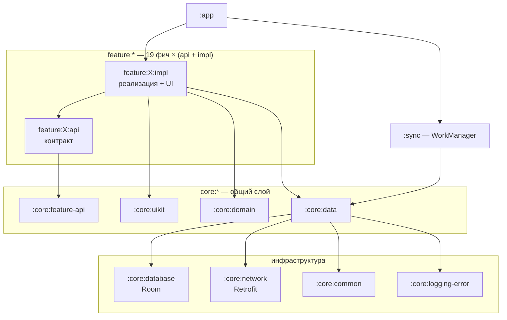

<h1 align="center">Илья Воскобойников</h1>

<b>Android Engineer</b> · Kotlin · Jetpack Compose · Kotlin Multiplatform · 4+ года коммерческого опыта

  
  
  

  
  
  
  

# 👋 Обо мне

Android-разработчик с 4+ годами коммерческого опыта. Делал мобильные приложения с нуля: от анализа
требований и проектирования архитектуры до публикации в сторах и дальнейшего развития.
Модернизировал существующие решения — внедрение современных Android-подходов и повышение качества
разработки. Проводил технические собеседования, менторил разработчиков, выступал на конференциях
и писал технические статьи.

- 🧩 **Специализация:** Kotlin, Jetpack Compose, Clean Architecture, многомодульные проекты
- 🌍 **Kotlin Multiplatform:** «Монетка» собрана под Android и iOS из одной кодовой базы
- 💰 **Кроме кода:** релизы в сторах, аналитика и Crashlytics, реклама и внутренние покупки
- 🛠️ **Держу проект в порядке:** convention plugins, кастомные Lint-правила, CI/CD, тесты, документация
- 📄 **Резюме:** [PDF](https://github.com/IliaVoskoboinikov/cv/blob/main/ilia_voskoboinikov_android_cv_ru.pdf) · [репозиторий](https://github.com/IliaVoskoboinikov/cv)

# 📲 Приложения в сторах

| Приложение | Установок | Стек |
|---|---|---|
| **[Монетка: ДА/НЕТ](https://play.google.com/store/apps/details?id=v500a5v.ilua.admin.monetka)** · [App Store](https://apps.apple.com/ru/app/coin-yes-no/id6756816990) Симулятор монетки для быстрых решений. Android и iOS из одной кодовой базы; iOS-версия издана на аккаунте партнёра. | **100 тыс.+** | Kotlin Multiplatform · Compose Multiplatform · Koin · Firebase |
| **[Мафия: карточки](https://play.google.com/store/apps/details?id=soft.divan.mafia)** Оффлайн-ведущий для настольной «Мафии»: до 30 игроков, раздача ролей. | **5 тыс.+** | Kotlin · Compose (Material 3) · Hilt · DataStore · Play Billing · Yandex Ads |
| **[Генератор паролей](https://play.google.com/store/apps/details?id=soft.divan.admin.password)** Надёжные пароли с настраиваемой длиной и набором символов. | **1 тыс.+** | Kotlin Multiplatform · Compose Multiplatform · Coroutines · Firebase |
| **[Rubik's Timer](https://play.google.com/store/apps/details?id=soft.divan.rubik_sclock)** Таймер для спидкубинга: миллисекундная точность, скрамблы, статистика сборок. | **1 тыс.+** | Kotlin 2.3 · Compose (Material 3) · Hilt + KSP · Room · DataStore |
| **[World Words](https://play.google.com/store/apps/details?id=soft.divan.world.words)** Карточки для изучения иностранных слов с категориями и синхронизацией аккаунта. | **500+** | Kotlin · XML + Navigation · Koin · Room · Paging 3 · Firebase (Auth, Firestore, App Check) |

Установки — по данным Google Play, август 2026.

# 🏦 Finance Manager

  
  
  
  
  
  
  

[**Приложение для учёта личных финансов**](https://github.com/IliaVoskoboinikov/Finance-Manager) —
пет-проект, на котором пробую подходы, до которых в рабочих задачах не всегда доходят руки.
19 фич, каждая разделена на `api` (контракт) и `impl` (реализация), поэтому фичи ничего не знают
друг о друге. [Граф всех 49 модулей](https://github.com/IliaVoskoboinikov/Finance-Manager/blob/master/docs/graphs/modules_prodget/all_modules.png)
собирается автоматически.

| | |
|---|---|
| **Сборка** | 49 Gradle-модулей, version catalog, **convention plugins** в `build-logic` — с функциональными тестами на сами плагины |
| **Качество** | Detekt + правила для Compose, ktlint, модуль `:lint` с **кастомными Lint-чекерами**, Kover для покрытия, Spotify Ruler для контроля размера APK |
| **Тесты** | **185 unit-тестов**: JUnit, MockK, Robolectric, AssertJ, coroutines-test, work-testing |
| **UI** | Compose + Material 3, **Navigation 3**, Lottie-анимации, YCharts для графиков, выбор темы и цветовой схемы |
| **Данные** | Room + DataStore, Retrofit со своими интерсепторами (Auth, Retry, NetworkConnection, Logging), kotlinx.serialization |
| **Безопасность** | PIN и биометрия (`androidx.biometric`), `security-crypto`, OAuth через Yandex Auth SDK, JWT |
| **Фон** | Синхронизация через WorkManager (`:sync`), push-уведомления через FCM, Crashlytics |
| **CI/CD** | 4 workflow: сборка и тесты на PR, релизный пайплайн, автогенерация графа навигации |

  
  
  
  
  

**Документация:** каждый из 49 модулей описан своим `README.md`, плюс 12 сквозных документов —
[архитектура](https://github.com/IliaVoskoboinikov/Finance-Manager/blob/master/docs/architecture.md) ·
[модуляризация](https://github.com/IliaVoskoboinikov/Finance-Manager/blob/master/docs/modularization.md) ·
[Navigation 3](https://github.com/IliaVoskoboinikov/Finance-Manager/blob/master/docs/navigation3.md) ·
[тестирование](https://github.com/IliaVoskoboinikov/Finance-Manager/blob/master/docs/testing.md) ·
[CI/CD](https://github.com/IliaVoskoboinikov/Finance-Manager/blob/master/docs/ci-cd.md) ·
[синхронизация](https://github.com/IliaVoskoboinikov/Finance-Manager/blob/master/docs/synchronization.md) ·
[уведомления](https://github.com/IliaVoskoboinikov/Finance-Manager/blob/master/docs/notifications.md) ·
[БД](https://github.com/IliaVoskoboinikov/Finance-Manager/blob/master/docs/bd.md) ·
[авторизация](https://github.com/IliaVoskoboinikov/Finance-Manager/blob/master/docs/auth.md)

Ещё из проектов: **[design-patterns](https://github.com/IliaVoskoboinikov/design-patterns)** —
паттерны проектирования на Kotlin с примерами применения в Android.

# 🛠 Стек

  

|  |  |
|---|---|
| **Языки и платформы** | Kotlin, Java, Android, Kotlin Multiplatform (Android + iOS) |
| **UI** | Jetpack Compose, Compose Multiplatform, Material 3, Navigation 3, XML, Custom Views, Lottie, YCharts, Glide |
| **Архитектура** | Clean Architecture, MVVM, SOLID, многомодульность с разделением `api` / `impl` |
| **DI** | Hilt, Dagger 2, Koin |
| **Асинхронность и фон** | Coroutines, Flow, WorkManager, FCM |
| **Данные** | Room, SQLite, DataStore, Paging 3, kotlinx.serialization, multiplatform-settings |
| **Сеть и backend** | Retrofit, OkHttp, Ktor, WebSockets, Firebase (Auth, Firestore, Storage, App Check) |
| **Безопасность** | Biometric, security-crypto, OAuth (Yandex Auth SDK), JWT |
| **Тестирование** | JUnit, MockK, Mockito, Robolectric, AssertJ, Espresso, Kover |
| **Качество кода** | Detekt (+ правила для Compose), ktlint, Android Lint с кастомными чекерами, Spotify Ruler |
| **Сборка и CI/CD** | Gradle KTS, version catalog, convention plugins, KSP, GitHub Actions |
| **Продукт** | Google Play Billing, Play In-App Review, Yandex MobileAds, Crashlytics, Analytics |

# 📊 GitHub

  <picture>
    <source media="(prefers-color-scheme: dark)" srcset="https://github-readme-stats.vercel.app/api?username=IliaVoskoboinikov&show_icons=true&hide_border=true&include_all_commits=true&count_private=true&locale=ru&theme=github_dark">
    
  </picture>
  <picture>
    <source media="(prefers-color-scheme: dark)" srcset="https://github-readme-stats.vercel.app/api/top-langs/?username=IliaVoskoboinikov&layout=compact&hide_border=true&langs_count=8&locale=ru&theme=github_dark">
    
  </picture>

# 📫 Контакты

- 📧 **Email:** [ilia.voskoboinikov@mail.ru](mailto:ilia.voskoboinikov@mail.ru)
- 📱 **Telegram:** [@VoskoboinikovIS](https://t.me/VoskoboinikovIS)
- 📄 **Резюме:** [PDF](https://github.com/IliaVoskoboinikov/cv/blob/main/ilia_voskoboinikov_android_cv_ru.pdf)
