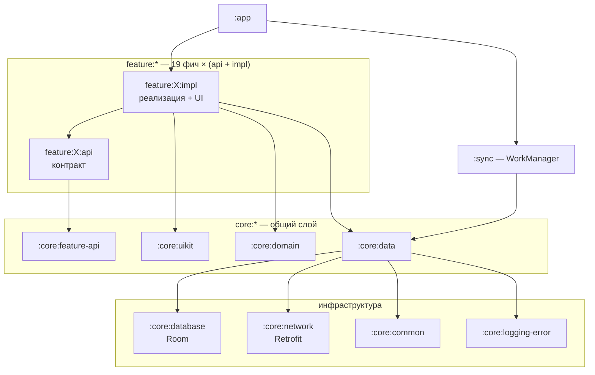

<h1 align="center">Илья Воскобойников</h1>

<b>Android Engineer</b> · Kotlin · Jetpack Compose · Kotlin Multiplatform · 4+ года коммерческого опыта

  
  
  

  
  
  
  

# 👋 Обо мне

Android-разработчик с 4+ годами коммерческого опыта. Делал мобильные приложения с нуля: от анализа
требований и проектирования архитектуры до публикации в сторах и дальнейшего развития.
Модернизировал существующие решения — внедрение современных Android-подходов и повышение качества
разработки. Проводил технические собеседования, менторил разработчиков, выступал на конференциях
и писал технические статьи.

- 🧩 **Специализация:** Kotlin, Jetpack Compose, Clean Architecture, многомодульные проекты
- 🌍 **Kotlin Multiplatform:** «Монетка» и «Генератор паролей»; «Монетка» собрана под Android и iOS из одной кодовой базы
- 💰 **Полный цикл продукта:** релизы в сторах, аналитика и Crashlytics, монетизация через рекламу и in-app покупки
- 🛠️ **Инженерная культура:** convention plugins, кастомные Lint-правила, CI/CD, тесты, документация
- 📄 **Резюме:** [PDF](https://github.com/IliaVoskoboinikov/cv/blob/main/ilia_voskoboinikov_android_cv_ru.pdf) · [репозиторий](https://github.com/IliaVoskoboinikov/cv)

 

# 📲 Приложения в сторах

| Приложение | Установок | Стек |
|---|---|---|
| **[Монетка: ДА/НЕТ](https://play.google.com/store/apps/details?id=v500a5v.ilua.admin.monetka)** · [App Store](https://apps.apple.com/ru/app/coin-yes-no/id6756816990) Симулятор подбрасывания монетки для быстрых решений. Android и iOS из одной кодовой базы; iOS-версия издана на аккаунте партнёра. | **100 тыс.+** | Kotlin Multiplatform · Compose Multiplatform · Koin · multiplatform-settings · Firebase |
| **[Мафия: карточки](https://play.google.com/store/apps/details?id=soft.divan.mafia)** Оффлайн-ведущий для настольной «Мафии»: до 30 игроков, раздача ролей, настройка набора. | **5 тыс.+** | Kotlin · Compose (Material 3) · Hilt · Navigation Compose · DataStore · Play Billing · Yandex Ads |
| **[Генератор паролей](https://play.google.com/store/apps/details?id=soft.divan.admin.password)** Генерация надёжных паролей с настраиваемой длиной и набором символов. | **1 тыс.+** | Kotlin Multiplatform · Compose Multiplatform · Coroutines · Firebase |
| **[Rubik's Timer](https://play.google.com/store/apps/details?id=soft.divan.rubik_sclock)** Таймер для спидкубинга: миллисекундная точность, скрамблы, история и статистика сборок. | **1 тыс.+** | Kotlin 2.3 · Compose (Material 3) · Hilt + KSP · Room · DataStore · Navigation Compose |
| **[World Words](https://play.google.com/store/apps/details?id=soft.divan.world.words)** Карточки для изучения иностранных слов: категории, примеры, синхронизация аккаунта. | **500+** | Kotlin · XML + Navigation (SafeArgs) · Koin · Room · Paging 3 · Firebase (Auth, Firestore, Storage, App Check) · Glide |

Установки — по данным Google Play, август 2026.

**Что за этим стоит:** Firebase-бэкенд с авторизацией и App Check (Play Integrity) в World Words,
Google Play Billing в «Мафии», Yandex MobileAds и Play In-App Review, Crashlytics и аналитика во всех.
Версии инструментов держу актуальными — вплоть до AGP 9 / Kotlin 2.3 / compileSdk 36.

 

# 🏦 Finance Manager — флагманский проект

  

  
  
  
  
  
  
  
  

Приложение для учёта личных финансов. Проект, в котором мне интересна не витрина, а инженерия:
многомодульность с разделением `api` / `impl`, свои Gradle-плагины и Lint-правила, тесты и живой CI/CD.

### Архитектура

19 фич, каждая разделена на `api` (контракт) и `impl` (реализация) — фичи не знают друг о друге
и общаются только через контракты. Ниже — схема связей; [полный граф всех 49 модулей](https://github.com/IliaVoskoboinikov/Finance-Manager/blob/master/docs/graphs/modules_prodget/all_modules.png)
генерируется автоматически.

### Что внутри

| | |
|---|---|
| **Сборка** | 49 Gradle-модулей, version catalog, **convention plugins** в `build-logic` — с функциональными тестами на сами плагины |
| **Качество** | Detekt + правила для Compose, ktlint, модуль `:lint` с **кастомными Lint-чекерами**, Kover для покрытия, Spotify Ruler для контроля размера APK |
| **Тесты** | **185 unit-тестов**: JUnit, MockK, Robolectric, AssertJ, coroutines-test, work-testing |
| **UI** | Compose + Material 3, **Navigation 3**, Lottie-анимации, YCharts для графиков, выбор темы и цветовой схемы |
| **Данные** | Room + DataStore, Retrofit со своими интерсепторами (Auth, Retry, NetworkConnection, Logging), kotlinx.serialization |
| **Безопасность** | PIN и биометрия (`androidx.biometric`), `security-crypto`, OAuth через Yandex Auth SDK, JWT |
| **Фон** | Синхронизация через WorkManager (`:sync`), push-уведомления через FCM, Crashlytics |
| **CI/CD** | 4 workflow: сборка и тесты на PR, релизный пайплайн, автогенерация графа навигации |

### Экраны

  
  
  
  
  

### Документация

Каждый из 49 модулей описан собственным `README.md`, плюс 12 сквозных документов:

[Архитектура](https://github.com/IliaVoskoboinikov/Finance-Manager/blob/master/docs/architecture.md) ·
[Модуляризация](https://github.com/IliaVoskoboinikov/Finance-Manager/blob/master/docs/modularization.md) ·
[Navigation 3](https://github.com/IliaVoskoboinikov/Finance-Manager/blob/master/docs/navigation3.md) ·
[Тестирование](https://github.com/IliaVoskoboinikov/Finance-Manager/blob/master/docs/testing.md) ·
[CI/CD](https://github.com/IliaVoskoboinikov/Finance-Manager/blob/master/docs/ci-cd.md) ·
[Синхронизация](https://github.com/IliaVoskoboinikov/Finance-Manager/blob/master/docs/synchronization.md) ·
[Уведомления](https://github.com/IliaVoskoboinikov/Finance-Manager/blob/master/docs/notifications.md) ·
[База данных](https://github.com/IliaVoskoboinikov/Finance-Manager/blob/master/docs/bd.md) ·
[Авторизация](https://github.com/IliaVoskoboinikov/Finance-Manager/blob/master/docs/auth.md) ·
[Result в домене](https://github.com/IliaVoskoboinikov/Finance-Manager/blob/master/docs/domain-result.md)

 

# 💡 Другие проекты

| Проект | О чём |
|---|---|
| **[design-patterns](https://github.com/IliaVoskoboinikov/design-patterns)** | Реализации паттернов проектирования на Kotlin с примерами применения в Android |

 

# 🛠 Стек

**Языки и платформы**

  
  
  
  
  

**UI**

  
  
  
  
  
  
  
  

**Архитектура и DI**

  
  
  
  
  
  

**Данные и сеть**

  
  
  
  
  
  
  
  
  

**Асинхронность и фон**

  
  
  
  

**Backend-интеграции и безопасность**

  
  
  
  
  
  
  

**Тестирование и качество**

  
  
  
  
  
  
  
  
  
  

**Сборка и инфраструктура**

  
  
  
  
  
  
  
  

**Продукт и монетизация**

  
  
  
  
  

# 📊 GitHub

  <picture>
    <source media="(prefers-color-scheme: dark)" srcset="https://github-readme-stats.vercel.app/api?username=IliaVoskoboinikov&show_icons=true&hide_border=true&include_all_commits=true&count_private=true&locale=ru&theme=github_dark">
    
  </picture>
  <picture>
    <source media="(prefers-color-scheme: dark)" srcset="https://github-readme-stats.vercel.app/api/top-langs/?username=IliaVoskoboinikov&layout=compact&hide_border=true&langs_count=8&locale=ru&theme=github_dark">
    
  </picture>

  
  

 

# 📫 Контакты

  
  
  

